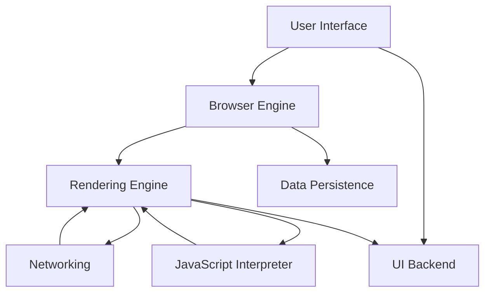

1. How does the internet work?

- Internet là mạng lưới toàn cầu gồm các máy tính được kết nối với nhau bằng giao thức TCP/IP
- Internet hoạt động bằng cách kết nối các thiết bị và hệ thống máy tính với nhau bằng cách sử dụng giao thức tiêu chuẩn, chẳng hạn như TCP/IP
- Các yêu cầu được truyền qua các nhà cung cấp dịch vụ Internet đến các máy chủ DNS để chuyển đổi thành địa chỉ IP

2. What is HTTP?

- Giao thức truyền tải siêu văn bản qua web bằng mô hình request-response
- Giao tiếp giữa máy chủ và trình duyệt
- Đặc điểm:
  - Stateless (không lưu trạng thái giữa các request)
  - Client-server model

- Mỗi yêu cầu là độc lập
- HTTPS là phiên bản mã hóa của HTTP (HTTP + SSL/TLS)

3. What is Domain?

- Là địa chỉ internet dễ đọc với con người
- Được dịch sang địa chỉ IP để máy tính nhận dạng
- Quản lý bởi các nhà cung cấp, đăng kí

4. What is hosting?

- Cung cấp không gian máy chủ và phân phối website trên internet
- Chức năng:
  - Lưu trữ code, database, file website
  - Cung cấp CPU, RAM, storage, network

5. DNS and how it works?

- DNS: Hệ thống tên miền
- Dịch các ten miền dễ đọc thành địa chỉ IP

6. Browsers and how it works?

- Trình duyệt web là 1 chương trình phần mềm cho phép người dùng truy cập thông tin trên Internet thông qua Mạng lưới toàn cầu (World Wide Web)
- Diễn giải HTML, CSS và Javascript để hiển thị các trang web
- Hoạt động:

* User interface: tương tác giữa người dùng và trình duyệt
* Browser Engine: Tầng cung cấp các hành động để giao tiếp và xử lý dữ liệu từ tầng Rendering Engine lên User Interface và ngược lại
* Rendering Engine: Xử lý các thẻ - câu lệnh HTML, CSS, XML, JS để hình thành giao diện lên tầng User Interface
* Networking: Có nhiệm vụ gọi các giao thức về mạng (VD: HTTP)
* UI backend: Xử lý và hiển thị các UI component như textbox, dropdown
* JS Interpreter: Xử lý và thực thi các đoạn mã JS để hiển thị lên trang web
* Data persistence: Có chức năng lưu trữ thông tin và dữ liệu trên máy local (Cache, local storage, cookies …)

